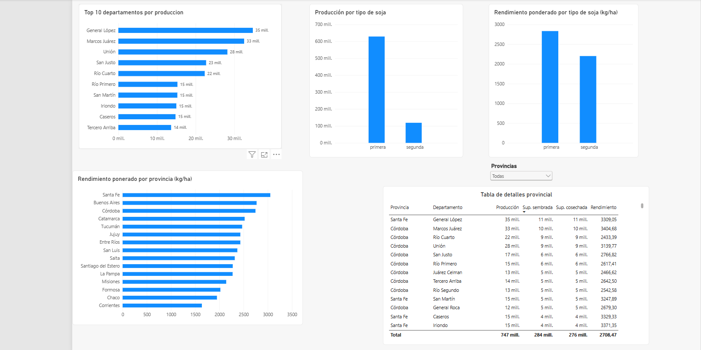

# Argentina Soybean Production Analysis

Proyecto de análisis de datos sobre la producción histórica de soja en Argentina utilizando **SQL, PostgreSQL y Power BI**.

El objetivo fue construir un flujo completo de análisis: desde la carga y validación de datos crudos, pasando por limpieza, normalización y análisis con SQL, hasta la creación de un dashboard interactivo en Power BI.

---

## Objetivo del proyecto

Analizar la evolución de la producción de soja en Argentina e identificar:

- Las provincias con mayor producción.
- Los departamentos más productivos.
- Las diferencias entre soja de primera y soja de segunda.
- La evolución de la producción a lo largo del tiempo.
- Los niveles de rendimiento por provincia y departamento.
- La concentración geográfica de la producción.
- Los años récord de producción por provincia.

---

## Tecnologías utilizadas

- SQL
- PostgreSQL
- pgAdmin 4
- Power BI
- DAX
- Git
- GitHub
- VS Code

---

## Datos utilizados

El proyecto utiliza dos datasets históricos:

- Soja de primera
- Soja de segunda

Los datos incluyen información sobre:

- Año
- Campaña
- Provincia
- Departamento
- Superficie sembrada
- Superficie cosechada
- Producción
- Rendimiento

En total se procesaron:

- 4.250 registros de soja de primera.
- 3.961 registros de soja de segunda.
- 8.211 registros en la tabla analítica consolidada.

---

## Cobertura temporal

Los datasets no poseen exactamente el mismo período:

- Soja de primera: 2000–2016
- Soja de segunda: 2000–2019

Para realizar comparaciones entre ambos tipos de soja y análisis agregados nacionales se utilizó el período común:

**2000–2016**

Los registros posteriores a 2016 se conservaron para posibles análisis específicos de soja de segunda.

---

## Proceso de trabajo

El proyecto se desarrolló siguiendo un flujo de análisis reproducible:

```text
CSV originales
      ↓
PostgreSQL
      ↓
Tablas RAW
      ↓
Validación de datos
      ↓
Limpieza y normalización
      ↓
Tabla analítica consolidada
      ↓
Análisis SQL
      ↓
Power BI
      ↓
Dashboard e insights
```

---

## Calidad y limpieza de datos

Durante la etapa de validación se detectaron diferentes problemas de calidad.

### Valores faltantes

Se encontraron identificadores de departamento nulos:

- Soja de primera: 40 registros
- Soja de segunda: 9 registros

### Valores no numéricos

En soja de primera se detectaron valores `SD` en:

- Producción: 3 registros
- Rendimiento: 3 registros

Estos valores fueron transformados a `NULL`.

### Problemas de codificación

Se encontraron nombres geográficos con errores de codificación, por ejemplo:

```text
Córdoba → Córdoba
Tucumán → Tucumán
Entre Ríos → Entre Ríos
Marcos Juárez → Marcos Juárez
General López → General López
```

Los nombres de provincias y departamentos fueron normalizados mediante SQL.

### Anomalías de superficie

Se detectaron registros donde:

```text
superficie cosechada > superficie sembrada
```

Estos registros no fueron eliminados ni modificados.

En su lugar se creó una variable de control:

```text
anomaly_harvested_gt_planted
```

para conservar el dato original y permitir su identificación durante el análisis.

---

## Estructura de la base de datos

Los datos fueron organizados en tres niveles.

### RAW

```text
soja_primera_raw
soja_segunda_raw
```

Contienen los datos originales importados desde los archivos CSV.

### CLEAN

```text
soja_primera_clean
soja_segunda_clean
```

Contienen los datos después de las transformaciones y normalizaciones.

### ANALYTICS

```text
soja_analytics
```

Tabla consolidada creada mediante `UNION ALL` para realizar los análisis.

---

## SQL utilizado

El proyecto aplica diferentes técnicas de SQL:

- SELECT
- WHERE
- GROUP BY
- ORDER BY
- HAVING
- CASE
- COUNT
- SUM
- AVG
- ROUND
- DISTINCT
- NULLIF
- UNION ALL
- Subconsultas
- CTEs
- INNER JOIN
- Funciones de ventana
- LAG
- ROW_NUMBER
- PARTITION BY

---

## Principales resultados

### Producción por tipo de soja

Durante el período común 2000–2016, la soja de primera presentó una producción acumulada considerablemente superior a la soja de segunda.

También mostró mayores niveles de rendimiento.

---

### Concentración provincial

Las principales provincias productoras fueron:

1. Buenos Aires
2. Córdoba
3. Santa Fe
4. Entre Ríos
5. Santiago del Estero

Las cinco provincias concentraron aproximadamente:

**90,93 % de la producción total analizada.**

Esto muestra una fuerte concentración geográfica de la producción de soja.

---

### Participación provincial

Entre las principales provincias:

- Buenos Aires: aproximadamente 29 %
- Córdoba: aproximadamente 28 %
- Santa Fe: aproximadamente 22 %
- Entre Ríos: aproximadamente 7 %
- Santiago del Estero: aproximadamente 4 %

Buenos Aires, Córdoba y Santa Fe representan la mayor parte de la producción nacional analizada.

---

### Principales departamentos productores

Los departamentos con mayor producción acumulada fueron:

1. General López — Santa Fe
2. Marcos Juárez — Córdoba
3. Unión — Córdoba
4. Río Cuarto — Córdoba
5. San Justo — Córdoba

Los diez departamentos con mayor producción representaron aproximadamente:

**27,93 % de la producción total.**

Esto indica que la concentración es mucho mayor a nivel provincial que departamental.

---

### Departamentos con mayor rendimiento

Considerando únicamente departamentos con al menos 100.000 hectáreas cosechadas acumuladas, se destacaron:

1. Colón — Buenos Aires
2. General Arenales — Buenos Aires
3. Rojas — Buenos Aires
4. Pergamino — Buenos Aires
5. Salto — Buenos Aires

---

### Evolución temporal

Durante el período analizado:

- Año con mayor producción: **2014**
- Producción: **61.398.277 toneladas**
- Año con mayor rendimiento ponderado: **2008**
- Rendimiento ponderado: **1.897,70 kg/ha**
- Mayor crecimiento interanual: **2009 (+67,89 %)**
- Mayor caída interanual: **2008 (-31,28 %)**

La serie presenta variaciones importantes entre campañas.

---

### Años récord por provincia

Algunos de los principales años récord fueron:

- Buenos Aires: 2015
- Córdoba: 2014
- Santa Fe: 2009
- Entre Ríos: 2014
- Santiago del Estero: 2016

---

### Principales departamentos por provincia

#### Buenos Aires

1. Pergamino
2. General Villegas
3. 9 de Julio

#### Córdoba

1. Marcos Juárez
2. Unión
3. Río Cuarto

#### Santa Fe

1. General López
2. San Martín
3. Iriondo

#### Entre Ríos

1. Paraná
2. Gualeguaychú
3. Victoria

#### Santiago del Estero

1. Moreno
2. General Taboada
3. Belgrano

---

## Dashboard en Power BI

El proyecto incluye un dashboard interactivo desarrollado en Power BI y conectado directamente a PostgreSQL.

### Resumen Ejecutivo

La primera página permite visualizar:

- Producción total
- Superficie sembrada
- Superficie cosechada
- Rendimiento ponderado
- Evolución anual de la producción
- Top 5 provincias productoras
- Participación provincial
- Filtros por año y tipo de soja


---

### Análisis Regional

La segunda página permite analizar:

- Top 10 departamentos por producción
- Rendimiento ponderado por provincia
- Producción por tipo de soja
- Rendimiento por tipo de soja
- Filtro por provincia
- Tabla detallada por provincia y departamento



### Medidas DAX

El dashboard utiliza medidas DAX para que los indicadores respondan dinámicamente a los filtros.

Entre las principales medidas utilizadas se encuentran:

- Producción Total
- Superficie Sembrada Total
- Superficie Cosechada Total
- Rendimiento Ponderado
- Participación Producción %

El rendimiento ponderado se calculó utilizando la relación entre producción total y superficie cosechada.

---

## Estructura del repositorio

```text
argentina-soybean-sql-analysis/
│
├── data/
│   └── raw/
│       ├── soja_primera.csv
│       └── soja_segunda.csv
│
├── sql/
│   ├── 01_create_tables.sql
│   ├── 02_data_validation.sql
│   ├── 03_data_cleaning.sql
│   ├── 03b_normalize_geography.sql
│   ├── 04_create_analytics_table.sql
│   ├── 05_exploratory_analysis.sql
│   ├── 06_provincial_analysis.sql
│   ├── 07_department_analysis.sql
│   ├── 08_temporal_analysis.sql
│   ├── 09_provincial_records.sql
│   └── 10_department_rankings.sql
│
├── results/
│   ├── provincial_production.csv
│   ├── annual_production.csv
│   ├── department_production.csv
│   └── provincial_records.csv
│
├── powerbi/
│   └── argentina_soybean_dashboard.pbix
│
├── images/
│   ├── resumen_ejecutivo.png
│   └── analisis_regional.png
│
└── README.md
```

---

## Archivos SQL

Los scripts SQL están organizados de forma secuencial para documentar todo el proceso:

| Archivo | Descripción |
| --- | --- |
| `01_create_tables.sql` | Creación de las tablas iniciales |
| `02_data_validation.sql` | Validación y control de calidad |
| `03_data_cleaning.sql` | Limpieza y transformación de datos |
| `03b_normalize_geography.sql` | Normalización de provincias y departamentos |
| `04_create_analytics_table.sql` | Creación de la tabla analítica consolidada |
| `05_exploratory_analysis.sql` | Análisis exploratorio |
| `06_provincial_analysis.sql` | Análisis por provincia |
| `07_department_analysis.sql` | Análisis por departamento |
| `08_temporal_analysis.sql` | Análisis temporal e interanual |
| `09_provincial_records.sql` | Años récord por provincia |
| `10_department_rankings.sql` | Rankings departamentales |

---

## Habilidades demostradas

Este proyecto demuestra conocimientos en:

- Importación de datos a PostgreSQL.
- Modelado básico de datos.
- Validación de calidad de datos.
- Limpieza y transformación con SQL.
- Manejo de valores nulos.
- Normalización de datos categóricos.
- Agregaciones y análisis descriptivo.
- Subconsultas.
- CTEs.
- Funciones de ventana.
- Rankings.
- Análisis temporal.
- Cálculo de métricas ponderadas.
- Integración de PostgreSQL con Power BI.
- Creación de medidas DAX.
- Diseño de dashboards interactivos.
- Git y GitHub para control de versiones.

---

## Conclusiones

El análisis muestra que la producción de soja se encuentra fuertemente concentrada en las principales provincias agrícolas del país, especialmente Buenos Aires, Córdoba y Santa Fe.

Las cinco provincias con mayor producción concentran aproximadamente el 90,93 % del volumen analizado, mientras que los diez departamentos más productivos representan el 27,93 %. Esto muestra que la concentración es considerablemente mayor a nivel provincial que departamental.

También se observaron diferencias entre soja de primera y soja de segunda en términos de producción, superficie y rendimiento.

A lo largo del proyecto se detectaron y trataron problemas reales de calidad de datos, incluyendo valores faltantes, valores no numéricos, inconsistencias de codificación y anomalías de superficie.

El resultado final es un flujo reproducible de análisis que combina PostgreSQL y SQL para la preparación y análisis de datos, junto con Power BI y DAX para la visualización y comunicación de resultados.

---

## Autor

Aldo Capuano
